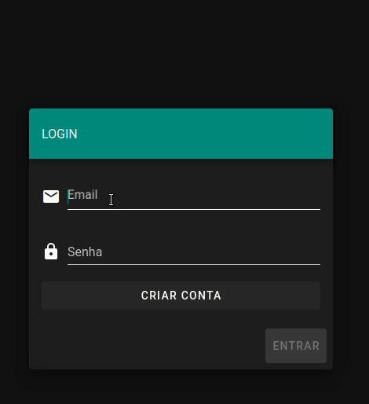
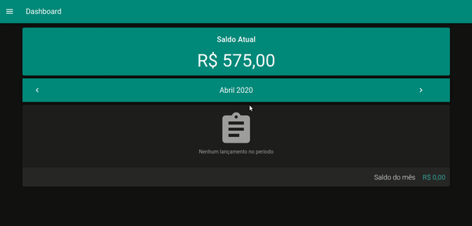
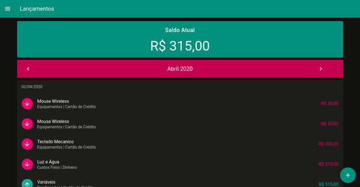
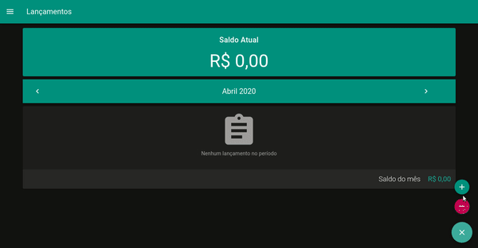
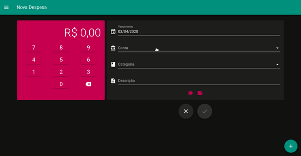
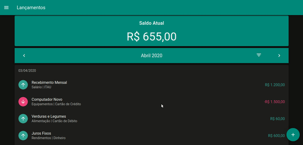
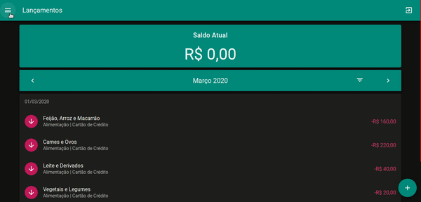

<h1 align="center">
   Gerenciador De Finanças
</h1>

<h4 align="center">
  🚀 Projeto Pessoal 2.0
</h4>

  

  
  
  

  

  <a href="#rocket-tecnologias">Tecnologias</a>&nbsp;&nbsp;&nbsp;|&nbsp;&nbsp;&nbsp;
  <a href="#-projeto">Projeto</a>&nbsp;&nbsp;&nbsp;|&nbsp;&nbsp;&nbsp;
  <a href="#-como-contribuir">Como contribuir</a>&nbsp;&nbsp;&nbsp;|&nbsp;&nbsp;&nbsp;
  <a href="#memo-licença">Licença</a>

 

## :rocket: Tecnologias 

    
    

## 💻 Projeto

O Gerenciador de Finanças tem como objetivo permitir o controle de gastos ou de receitas do usuário.

Este projeto foi desenvolvido com as seguintes tecnologias:

- [Node.js](https://nodejs.org/en/)
- [Vue](https://vuejs.org/)
- [Vue Native](https://vue-native.io/)
- [GraphQL Yoga](https://github.com/prisma-labs/graphql-yoga)
- [Apollo Boost](https://www.apollographql.com/docs/react/get-started/) **A Documentação é do React, entretando foi utilizado para o Vue**
- [PrismaIO](https://www.prisma.io/)
- [postgreSQL](https://www.postgresql.org/)
- [Docker](https://www.docker.com/)

## :pushpin: Recursos
- :mag_right:  Explore e gerencie seus custos;
- :money_with_wings:  Crie uma conta para gerenciar custos diários, mensais e anuais;
- :bookmark_tabs:  Como usuário, você pode registrar novas formas de pagamento e organizá-las de acordo com suas necessidades;
- :chart_with_upwards_trend:  Visualize graficamente suas despesas e receitas para melhor tomada de decisão;

## Modelagem dos Dados

:page_with_curl: <a href="https://dbdiagram.io/d/5ec7cc3339d18f5553ff9c3e">DB Diagram</a>

## Login:

## Dashboard Inicial:

## Nova Receita/Despesa

## Nova Receita

## Nova Despesa

## Filtros

## Gráficos

## 🤔 Como contribuir

- Faça um fork desse repositório;
- Cria uma branch com a sua feature: `git checkout -b minha-feature`;
- Faça commit das suas alterações: `git commit -m 'feat: Minha nova feature'`;
- Faça push para a sua branch: `git push origin minha-feature`.

Depois que o merge da sua pull request for feito, você pode deletar a sua branch.

## :memo: Licença

Esse projeto está sob a licença MIT. Veja o arquivo [LICENSE](LICENSE) para mais detalhes.

